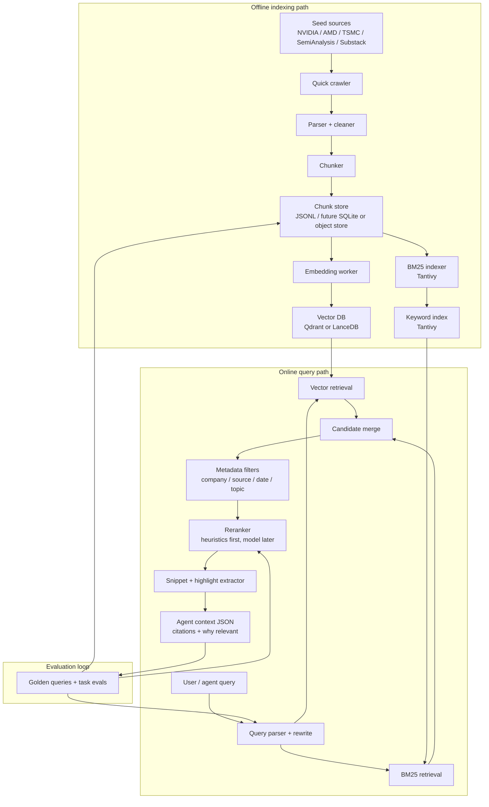

# semi-search


Semi Search: agent-first search for semiconductor research.

The goal is to build an agent-first search engine, in Rust, optimized for coding agents, research agents, and semiconductor fundamental investing workflows. Instead of generic web search, this project focuses on retrieving high-signal semiconductor context: company filings, product architecture notes, technical blogs, industry analysis, news, and supply-chain commentary.

Initial target corpus:

- NVIDIA
- AMD
- TSMC
- SemiAnalysis
- SemiVision Substack
- Irrational Analysis Substack
- Semiconductor news, blogs, architecture notes, and investment research sources

## Product goal

Given a question like:

> What are the key differences between NVIDIA Blackwell and AMD MI300 for AI training economics?

The system should retrieve source-backed context with citations, including:

- relevant architecture details
- company/product references
- industry analysis
- news and blog commentary
- freshness metadata
- snippets that can be passed directly into a coding or research agent

This is not just a vector database. It is a full retrieval system:

1. crawl and ingest sources
2. clean, parse, deduplicate, and chunk documents
3. build keyword + vector indexes
4. retrieve and rerank relevant context
5. expose agent-friendly search APIs
6. evaluate search quality continuously


## Current v0 vertical slice

The repo now has a runnable local prototype:

```bash
cargo run -- crawl --config configs/seeds.example.toml
cargo run -- embed --chunks data/chunks.jsonl --out data/embedded_chunks.jsonl
# Optional OpenAI-compatible embeddings (requires a reachable API base; API key optional for local test servers)
SEMI_SEARCH_EMBEDDING_API_BASE=http://localhost:8000/v1 \
  cargo run -- embed --chunks data/chunks.jsonl --out data/embedded_chunks.jsonl \
  --provider openai-compatible --model text-embedding-3-small --dimensions 1536
cargo run -- index --chunks data/chunks.jsonl --index data/index
cargo run -- search --index data/index --query "GB200 interconnect bandwidth inference" --company NVIDIA --topic networking --limit 3
```

A bounded semiconductor corpus config is included for real sources:

```bash
cargo run -- crawl --config configs/seeds.semiconductors.toml
```

That config seeds NVIDIA, AMD, TSMC, SemiAnalysis, SemiVision Substack, and
Irrational Analysis Substack. It is intentionally production-shaped but small:
`max_pages` is a hard stop, discovery stays same-domain, sitemap/RSS URLs are
only hints, and allow/deny path patterns keep the crawl scoped. Tests use
`fixture_responses` to map URLs to local files so discovery behavior stays
deterministic and never depends on live websites.

What works today:

- fixture/local/HTTP seed fetching
- bounded same-domain link discovery with sitemap/RSS hints
- global/per-seed `max_pages`, allow path patterns, and deny path patterns
- deterministic `fixture_responses` fallback for tests and offline crawls
- basic HTML/plain-text parsing and cleaning
- overlapping word chunks with source metadata
- JSONL chunk output
- deterministic local embedding generation for offline/e2e development
- embedding provider abstraction with local and OpenAI-compatible HTTP providers
- embedding metadata stored per embedded chunk: provider, model, version, dimensions, and method
- Tantivy/BM25 indexing
- local vector store written beside the Tantivy index
- hybrid BM25 + vector search with merge/dedup/rerank
- metadata filters for company, source type, domain, date, and topic
- cited JSON search results with title, URL, snippet, score, source, metadata, and score components
- integration tests covering crawl → embed → index → filtered hybrid search


## Embedding providers

`semi-search embed` defaults to deterministic local embeddings so tests and local development do not need a network or API key:

```bash
cargo run -- embed --chunks data/chunks.jsonl --out data/embedded_chunks.jsonl \
  --provider local --dimensions 128
```

Provider options:

- `--provider local` — local hash/BOW embedding provider, deterministic and offline. Default model: `local-hash-bow-v1`.
- `--provider openai-compatible` — sends requests to an OpenAI-compatible `/embeddings` HTTP endpoint.

OpenAI-compatible configuration:

- `SEMI_SEARCH_EMBEDDING_API_BASE` — API base, default `https://api.openai.com/v1`
- `SEMI_SEARCH_EMBEDDING_API_KEY` — bearer token, optional so local test servers can run without a key
- `SEMI_SEARCH_EMBEDDING_MODEL` — model fallback when `--model` is omitted
- `--model` — overrides the model/env value
- `--dimensions` — requested/stored embedding dimension count

Each embedded JSONL row includes `embedding_model.provider`, `embedding_model.model`, and `embedding_model.dimensions` for re-embedding/reproducibility.

## Build order

The first milestone is a quick crawler that produces useful chunks, not a full-scale crawler.

1. **Quick crawl to chunks** — seed sources, fetch pages, parse text, chunk documents, and create a local chunk store.
2. **Retrieval core** — build BM25 + vector indexes, hybrid retrieval, filters, ranking, and reranking.
3. **Agent-first context** — expose compact cited results that agents can consume directly.
4. **Evaluation loop** — measure search quality through golden queries and downstream research usefulness.

Most engineering depth should go into the retrieval core: index design, low-latency query serving, filters, ranking, reranking, citations, and evals. The crawler should stay simple until the retrieval loop works.

## Prototype scope

The first prototype should be deliberately small and useful:

- crawl or ingest a small curated set of semiconductor URLs, with autodiscovery from sitemaps, RSS feeds, and internal links
- parse HTML and Markdown documents
- chunk documents into source-backed passages
- index chunks with keyword search and vector embeddings
- expose a simple local search API
- return results with title, URL, snippet, score, and source metadata
- include a small evaluation set of semiconductor investing queries

## Proposed architecture

```text
Semiconductor sources
        │
        ▼
Crawler / connectors
        │
        ▼
Parser / cleaner / deduper
        │
        ▼
Chunker + metadata extractor
        │
        ▼
Embeddings + keyword terms
        │
        ▼
Vector index + BM25 index
        │
        ▼
Hybrid retrieval API
        │
        ▼
Reranker / source-quality scorer
        │
        ▼
Agent context builder
```

## Core systems

- Crawler and source connectors, including sitemap/RSS/link autodiscovery
- Document processing pipeline
- Chunking and metadata extraction
- Storage for raw docs, cleaned docs, chunks, and crawl state
- Vector index
- Keyword/BM25 index
- Hybrid retrieval and reranking
- Search/query API
- Agent integration layer
- Evaluation harness
- Feedback and observability loop
- Trust, provenance, and citation layer


## Focus area: retrieval storage and low-latency serving

The next major work should focus on points **5** and **6** from the architecture plan:

5. **Store vectors and keyword indexes in retrieval systems**
6. **Serve low-latency queries with filters, ranking, and reranking**

This is the core of Semi Search. Crawling creates the corpus, but retrieval quality is the product.

### What is done

Current v0 has a thin end-to-end slice:

- seed-based fixture/local/HTTP fetch
- basic HTML/plain-text parsing
- basic cleaning
- overlapping word chunks
- JSONL chunk store
- Tantivy/BM25 keyword index
- CLI search over the keyword index
- cited JSON results with title, URL, snippet, score, and source
- integration test for crawl → chunk → index → search

Current query path:

```text
query -> Tantivy BM25 + local vector search -> merge/dedup -> filters -> rerank -> JSON cited results
```

### What is left

The retrieval core still needs:

- production embedding model for every chunk
- Qdrant/LanceDB backend for semantic search
- persistent vector index service instead of local JSON vector store
- richer filters and boolean filter composition
- stronger reranking layer
- source-quality and freshness scoring
- compact query-specific highlights
- latency benchmarks
- evaluation harness tied to real semiconductor research queries

### Vector DB direction

Do **not** build a custom vector DB first.

Start with a swappable vector-index interface:

```rust
trait VectorIndex {
    fn upsert_chunks(&self, chunks: &[EmbeddedChunk]) -> Result<()>;
    fn search(&self, query_embedding: &[f32], filters: SearchFilters, top_k: usize) -> Result<Vec<VectorHit>>;
}
```

Then use a proven backend for v1:

- **Qdrant** if we want a service-oriented vector DB with filtering and HNSW built in
- **LanceDB** if we want local embedded storage and easy iteration
- **hnswlib/faiss-style embedded index later** if we want to learn/build retrieval internals ourselves

Recommendation for now: **Qdrant first**, behind a Rust trait.

#### Qdrant backend (optional)

Local JSON vector storage remains the default; no Docker is needed for tests or the v0 CLI path.
To exercise the Qdrant backend, start Qdrant and opt in with env vars:

```yaml
# docker-compose.qdrant.yml
services:
  qdrant:
    image: qdrant/qdrant:v1.12.5
    ports:
      - "6333:6333"
    volumes:
      - qdrant_storage:/qdrant/storage

volumes:
  qdrant_storage:
```

```bash
docker compose -f docker-compose.qdrant.yml up -d
SEMI_SEARCH_VECTOR_BACKEND=qdrant \
  QDRANT_URL=http://localhost:6333 \
  QDRANT_COLLECTION=semi_search_chunks \
  cargo run -- index --chunks data/chunks.jsonl --index data/index
```

Env options:

- `SEMI_SEARCH_VECTOR_BACKEND=local|qdrant` (`local` default)
- `QDRANT_URL` (default `http://localhost:6333` when Qdrant is selected)
- `QDRANT_COLLECTION` (default `semi_search_chunks`)

Why:

- good metadata filtering
- production-shaped architecture
- easy local Docker setup
- lets us focus on hybrid retrieval and ranking instead of vector storage internals
- can be replaced later if we want custom retrieval systems

### Retrieval architecture



### Target query serving flow

```text
query
  -> parse intent and filters
  -> embed query
  -> BM25 top 100
  -> vector top 100
  -> merge candidates
  -> apply metadata filters
  -> deduplicate near-identical chunks
  -> rerank top 50
  -> extract query-specific highlights
  -> return top 10 cited agent-context results
```

### Ranking model v1

Start with transparent heuristic scoring:

```text
final_score =
  0.30 * bm25_score_normalized
+ 0.30 * vector_score_normalized
+ 0.10 * title_match
+ 0.10 * company_tag_match
+ 0.10 * source_quality
+ 0.05 * freshness
+ 0.05 * diversity_penalty_adjustment
```

This is easier to debug than an opaque model. Once we collect evals and feedback, add a learned reranker or LLM/cross-encoder reranking pass.

### Search filters v1

The API should support filters early:

```json
{
  "query": "TSMC CoWoS capacity constraints",
  "companies": ["TSMC", "NVIDIA", "AMD"],
  "source_types": ["company", "analysis", "substack", "news"],
  "domains": ["semianalysis.com"],
  "published_after": "2024-01-01",
  "topics": ["advanced_packaging", "ai_accelerators"]
}
```

For semiconductor research, filters are not a nice-to-have. They are how we separate company docs, market commentary, architecture notes, and stale news.

### Next implementation milestones

1. Add metadata-rich chunk schema
   - company tags
   - source type
   - domain
   - published/updated date
   - topic tags

2. Add embedding pipeline
   - generate embeddings for chunks
   - store embedding model/version
   - support re-embedding

3. Add vector index backend
   - implement `VectorIndex` trait
   - start with Qdrant or LanceDB
   - add local dev setup

4. Build hybrid search
   - BM25 + vector retrieval
   - candidate merge
   - filters
   - score normalization

5. Add reranking
   - heuristic reranker first
   - source/freshness/diversity signals
   - learned reranker later

6. Add evals and latency benchmarks
   - recall@5 / recall@10
   - MRR / NDCG
   - query latency p50/p95
   - downstream research usefulness

## Rust-first direction

The project should be Rust-first for performance, reliability, and eventual scale.

Likely components:

- crawler workers
- document parser pipeline
- chunk/index builder
- search API server
- evaluation CLI

Candidate ecosystem:

- `tokio` for async runtime
- `reqwest` for fetching
- `scraper` or `html5ever` for HTML parsing
- `tantivy` for BM25/full-text search
- Qdrant, LanceDB, or an embedded vector index for dense retrieval
- `axum` for the API server
- `serde` for data models

## Non-goals for v0

- crawling the entire web
- distributed infrastructure
- perfect ranking
- production-grade freshness scheduling
- paid/private source ingestion unless explicitly configured

The first win is simple: useful semiconductor search over a curated corpus, with citations.
